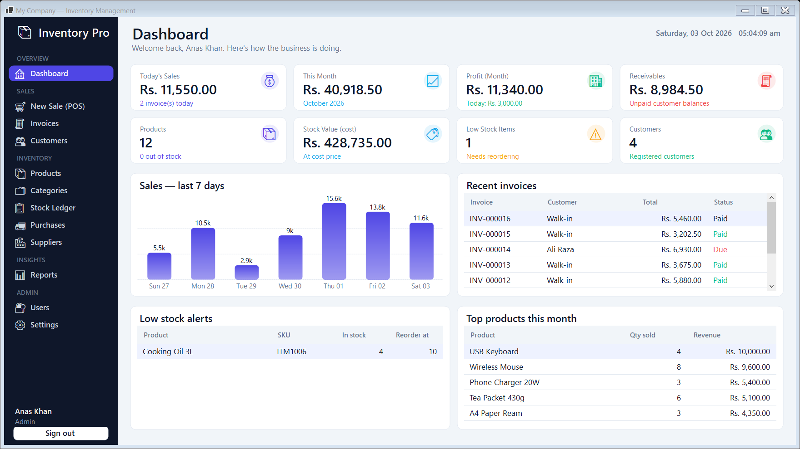
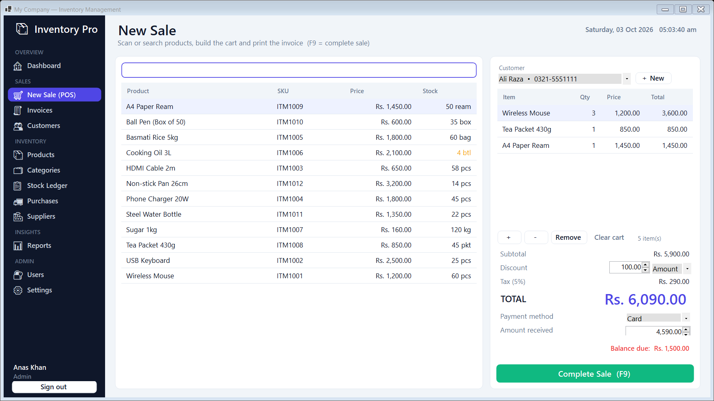
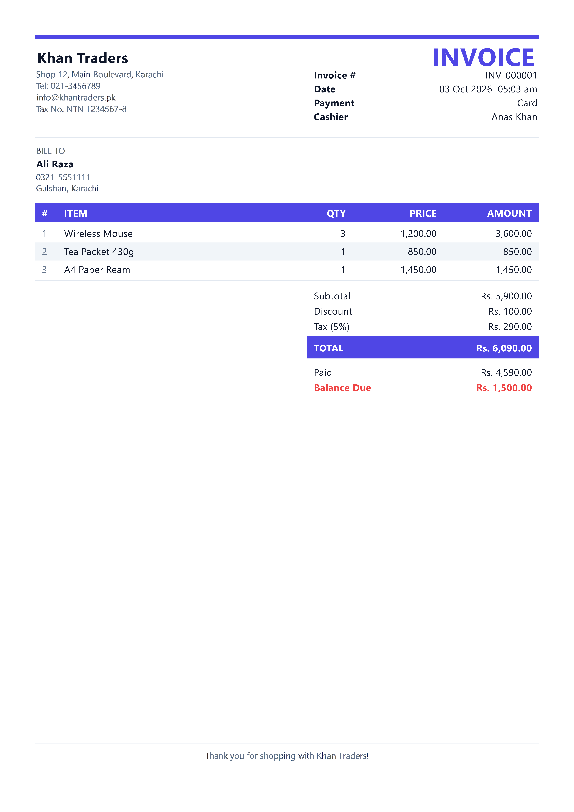
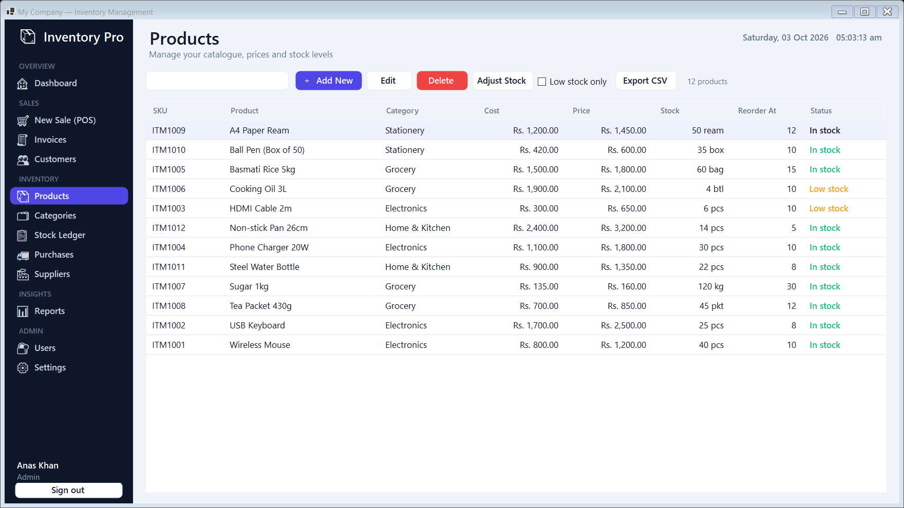
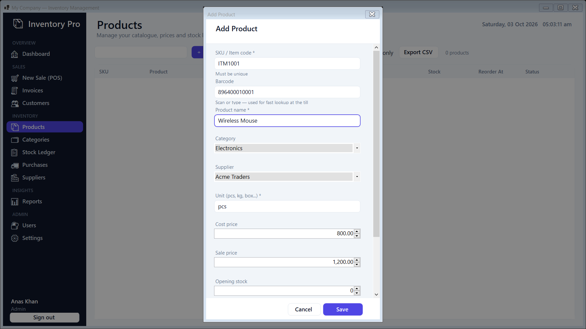
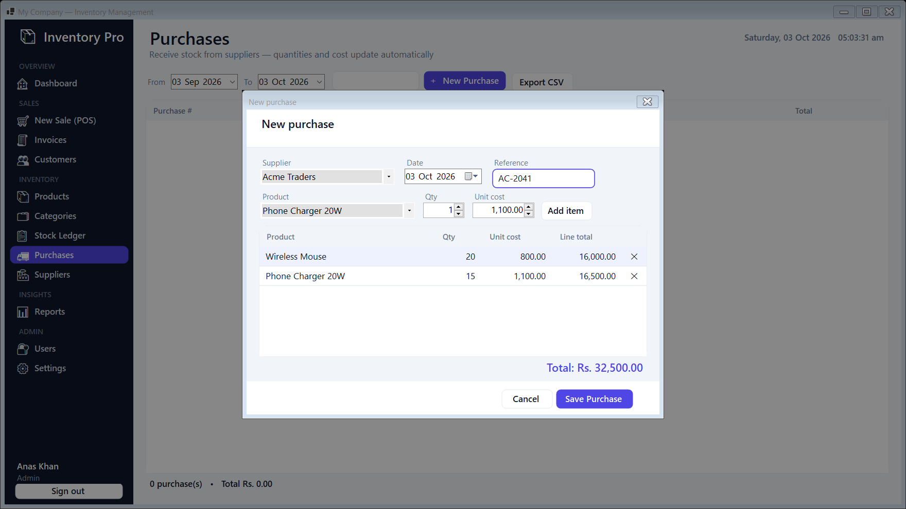
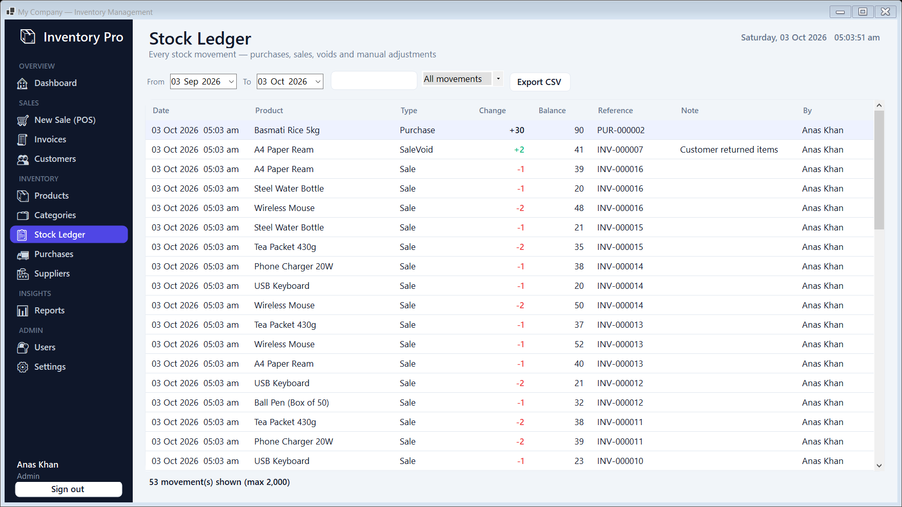
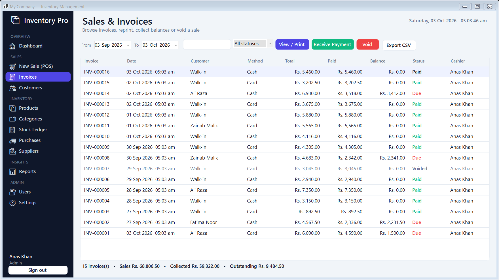
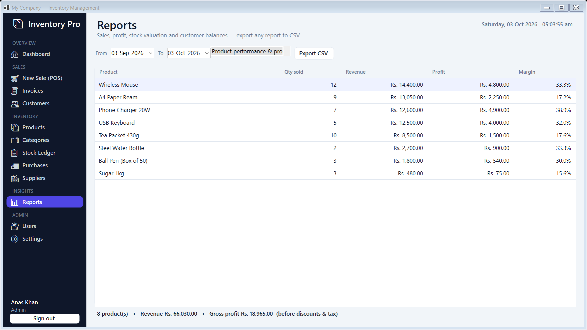
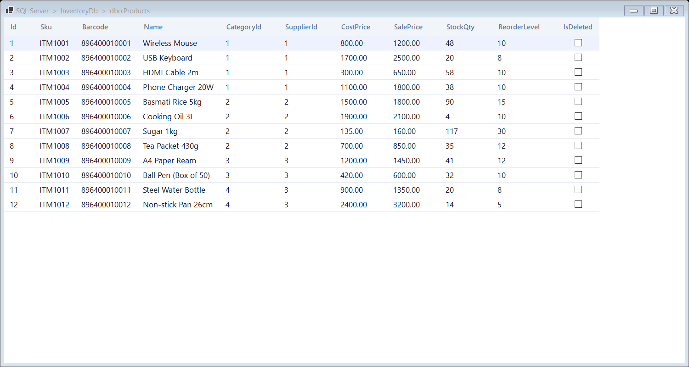

# Inventory Management System

A complete desktop application for shops and small businesses. It manages products, stock, purchases, point-of-sale billing, invoices and business reports.

Built with **C# · .NET 8 · WinForms · Entity Framework Core · SQL Server**.



## Table of contents

- [Features](#features)
- [Screenshots](#screenshots)
- [Tech stack](#tech-stack)
- [Architecture](#architecture)
- [Database](#database)
- [Roles and permissions](#roles-and-permissions)
- [Getting started](#getting-started)
- [First run](#first-run)
- [Recommended setup order](#recommended-setup-order)
- [How the main flows work](#how-the-main-flows-work)
- [Project structure](#project-structure)
- [Migrations](#migrations)
- [Backup](#backup)
- [Publish](#publish)
- [Troubleshooting](#troubleshooting)
- [Contact](#contact)

## Features

**Sales**
- Point of Sale with barcode / SKU / name search
- Cart with quantity control that can never exceed available stock
- Discount (amount or percentage), automatic tax, multiple payment methods
- Credit sales with partial payments and balance tracking
- Professional A4 invoices with print preview (PDF through "Microsoft Print to PDF")
- Invoice list with filters, reprint, receive payment and void (stock is returned)

**Inventory**
- Products with SKU, barcode, category, supplier, cost and sale price
- Low stock and out-of-stock indicators with a reorder level per product
- Purchases from suppliers update stock and cost automatically
- Manual stock adjustment with a mandatory reason
- Stock ledger: every movement (opening, purchase, sale, void, adjustment) with user, time and balance

**Business**
- Customers with live balance due
- Suppliers and categories
- Dashboard: today's and monthly sales, profit, receivables, stock value, low stock, 7-day chart, recent invoices, top products
- Reports: daily sales, product profit, stock valuation, reorder list, customer balances. All export to CSV

**Administration**
- Role-based access (Admin, Manager, Cashier)
- User management with protection for the last active admin
- Company settings: name, address, tax rate, currency, invoice prefix and footer
- One-click database backup

## Screenshots

| | |
|---|---|
|  |  |
| Point of Sale | Printable invoice |
|  |  |
| Products | Add product |
|  |  |
| New purchase | Stock ledger |
|  |  |
| Invoices | Reports |

## Tech stack

| Area | Technology |
|---|---|
| Language | C# 12 |
| Framework | .NET 8, Windows Forms |
| Data access | Entity Framework Core 8 (code first, migrations) |
| Database | SQL Server (Express, LocalDB or full) |
| Dependency injection | Microsoft.Extensions.DependencyInjection |
| Configuration | appsettings.json |

## Architecture

```
UI (WinForms)  →  Services  →  Persistence (EF Core)  →  SQL Server
```

- **UI** contains forms, pages, dialogs and custom drawn controls. Pages never talk to the database directly for business rules.
- **Services** hold the business logic. Sales, voids, purchases and stock adjustments each run inside a single database transaction.
- **Persistence** contains the `ApplicationDbContext` and one EF configuration class per table.
- Stock is reduced with a guarded update (`WHERE StockQty >= qty`), so a product can never be oversold even with several users.
- Records are never physically removed. Deleting sets `IsDeleted` and a global query filter hides the row (soft delete).
- `CreateBy`, `CreateDate`, `UpdateBy` and `UpdateDate` are filled in automatically by the DbContext on every save.
- Passwords are stored as salted PBKDF2 hashes.
- Invoice lines keep a copy of the product name, price and cost, so old invoices never change.

## Database

The database is created and upgraded automatically on start-up.

| Table | Purpose |
|---|---|
| `Users` | Login accounts, role and password hash |
| `CompanySettings` | One row: company details, tax rate, currency, invoice prefix |
| `Categories` | Product groups |
| `Suppliers` | Vendors |
| `Customers` | Customer directory |
| `Products` | Catalogue with live `StockQty` |
| `Sales` | Invoice header (totals, paid amount, status) |
| `SaleItems` | Invoice lines (name, price and cost are copied) |
| `Purchases` | Purchase header |
| `PurchaseItems` | Purchase lines |
| `StockMovements` | Ledger of every stock change |



## Roles and permissions

| Role | Access |
|---|---|
| Cashier | Dashboard, sales (POS), invoices, customers, products, categories, stock ledger |
| Manager | Everything a cashier has, plus purchases, suppliers, reports and voiding invoices |
| Admin | Everything, plus users and settings |

## Getting started

**Requirements**
- Windows 10 or later
- [.NET 8 SDK](https://dotnet.microsoft.com/download/dotnet/8.0) (to build) or the .NET 8 Desktop Runtime (to run)
- SQL Server (Express, LocalDB or full)

**Steps**

1. Clone the repository.
2. Open `appsettings.json` and set your SQL Server connection string:

   ```json
   {
     "ConnectionStrings": {
       "Default": "Server=.;Database=PrecticeInterviewDb;Trusted_Connection=True;TrustServerCertificate=True"
     }
   }
   ```

   For LocalDB use `Server=(localdb)\\MSSQLLocalDB`.
3. Run the application:

   ```bash
   dotnet run --project InVentry_Manegment.csproj
   ```

## First run

There is no default account. On the first launch the login screen asks you to create the administrator:

1. Enter your full name, a username and a password (at least 6 characters).
2. Click **Create Account & Continue**.

That first user is an Admin. You can create more users later from the **Users** page.

## Recommended setup order

1. **Settings**: company name, address, currency, tax rate
2. **Categories** and **Suppliers**
3. **Products** (enter the opening stock here)
4. **Customers** (optional)
5. **Users**: accounts for your staff
6. Start selling from **New Sale**

## How the main flows work

**Completing a sale** (one transaction)
1. Check that every product has enough stock
2. Reduce `Products.StockQty`
3. Create the `Sales` row and its `SaleItems`
4. Write a `StockMovements` entry (type Sale)
5. Commit. If anything fails, everything is rolled back

**Saving a purchase**: inserts `Purchases` and `PurchaseItems`, increases stock, updates the product cost and writes a Purchase ledger entry.

**Voiding an invoice**: marks the sale as voided, returns the stock and writes a SaleVoid ledger entry. A reason is required.

**Adjusting stock**: sets the counted quantity and writes an Adjustment ledger entry with the reason.

## Project structure

```
Data/          Table classes (one file per table) and the CommonField base class
Enums/         UserRole, PaymentMethod, SaleStatus, MovementType
Persistence/   ApplicationDbContext, design-time factory
  Configurations/   One EF configuration per table
Migrations/    EF Core migrations
Services/      Business logic: Inventory, Report, Auth, Settings, InvoicePrinter
  Models/      Request and result models
UI/            Login form, main form, custom controls
  Controls/    Button, input, card, chart, theme
  Dialogs/     Reusable dialogs
  Pages/       One file per screen
Docs/          Screenshots and walkthrough material
appsettings.json
```

## Migrations

Migrations are applied automatically when the application starts. After changing a table class, create a new migration:

```bash
dotnet ef migrations add MigrationName
```

## Backup

**Settings → Backup Database** creates a SQL Server `.bak` file. The chosen folder must be writable by the SQL Server service account.

## Publish

```bash
dotnet publish -c Release -r win-x64 --self-contained false
```

Copy the publish folder to the target computer and set its connection string in `appsettings.json`.

## Troubleshooting

| Problem | What to check |
|---|---|
| "Could not connect to or create the database" | SQL Server is running and the connection string in `appsettings.json` is correct |
| Certificate error with SQL Server | Keep `TrustServerCertificate=True` in the connection string |
| Backup fails | Use a folder that the SQL Server service account can write to |
| An unexpected error dialog | Details are written to the `logs` folder next to the executable |

## Contact

Questions, feedback or job opportunities are welcome.

**Anas Khan**, .NET Backend Developer
📧 [muhammadanaskhan.dev@gmail.com](mailto:muhammadanaskhan.dev@gmail.com)
MAK-